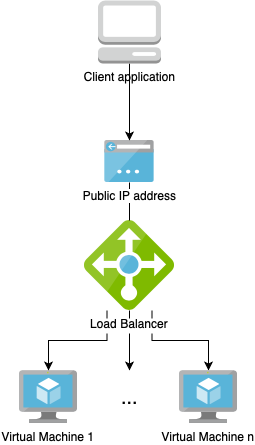

# CrateDB cluster on Azure VM using Terraform
This Terraform configuration will launch a CrateDB cluster on Azure. It consists of a public-facing load lancer with and a set of Virtual Machines.



The provided configuration is meant as an easy way to get started. It is not necessarily production-ready in all aspects, such as backups, high availability, and security. Please clone and extend the configuration to fit your individual needs, if needed.

## Setup
1. Crate a new `main.tf` Terraform configuration, referencing the CrateDB module:

  ```yaml
  module "cratedb-cluster" {
    source = "git@github.com:crate/crate-terraform.git//azure"

    # Your Azure Subscription ID
    subscription_id = "your-Azure-subscription-id"

    # Global configuration items
    config = {
      # Used for naming/tagging Azure resources
      project_name = "example-project"
      environment = "test"
      owner = "Crate.IO"
      team = "Customer Engineering"

      # Run "az account list-locations" for a full list
      location = "westeurope"
    }

    # CrateDB-specific configuration
    crate = {
      # Java Heap size in GB available to CrateDB
      heap_size_gb = 2

      cluster_name = "crate-cluster"

      # The number of nodes the cluster will consist of
      cluster_size = 2
    }

    # Azure VM specific configuration
    vm = {
      # The size of the disk storing CrateDB's data directory
      disk_size_gb = 512
      storage_account_type = "Premium_LRS"

      # Username to connect via SSH to the nodes
      user = "cratedb-vmadmin"
    }
  }

  output "cratedb" {
    value = module.cratedb-cluster
    sensitive = true
  }
```

2. Run `terraform init` to download and install all needed providers.

## Execution
To run the Terraform configuration:
1. Run `terraform plan` to validate the planned resource creation
2. Run `terraform apply` to execute the plan
3. Run `terraform output -json` to view the cleartext output, such as the CrateDB URL and login credentials

## Accessing CrateDB
The above last-mentioned step will output all needed information to connect to CrateDB. This includes the publicly accessible URL of the load balancer, as well as login credentials. On opening this URL in a browser, an HTTP Basic Auth appears.

Please note that it might take a couple of minutes before VMs are fully provisioned and CrateDB becomes accessible.

## Accessing Azure VMs
Azure VMs are not directly accessible as they have private IP addresses. To connect to them, use a [bastion host](https://docs.microsoft.com/en-us/azure/bastion/quickstart-host-portal). Please see `terraform output -json` for the user name and private key which are valid for all VMs.
